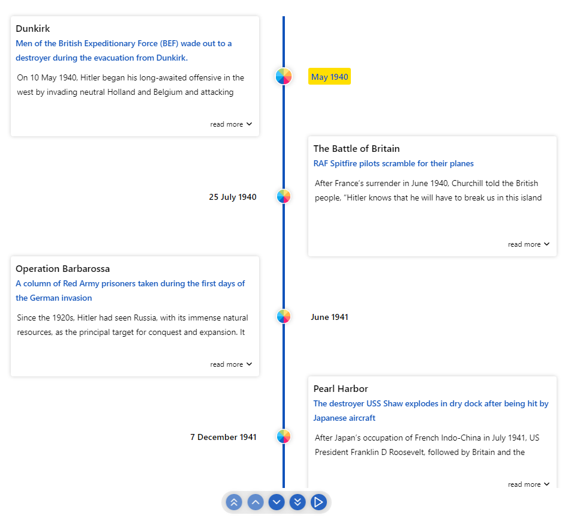

<div align="center">
  
  <br/>
  <br/>

</div>


<h2>Table of Contents</h2>

  - [🚥Vertical Alternating](#vertical-alternating)

### 🚥Vertical Alternating

In `VERTICAL_ALTERNATING` mode the timeline is rendered vertically with cards alternating between left and right side.

```sh
  <div style={{ width: "500px", height: "950px" }}>
    <Chrono
      items={items}
      mode="VERTICAL_ALTERNATING"
    />
  </div>
```




